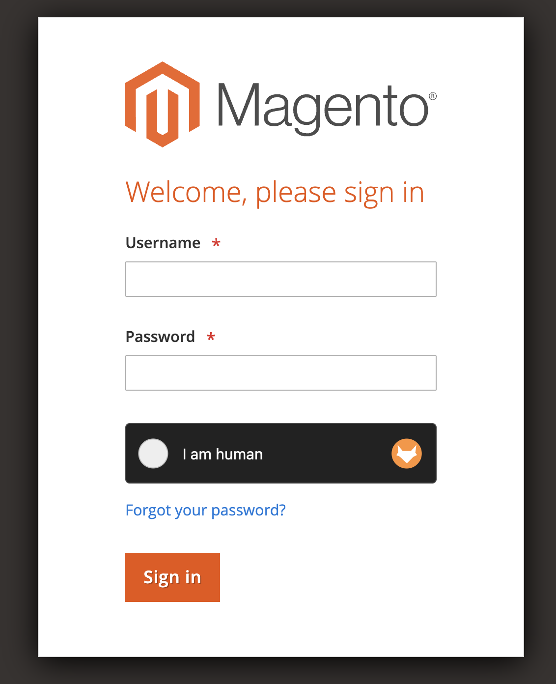
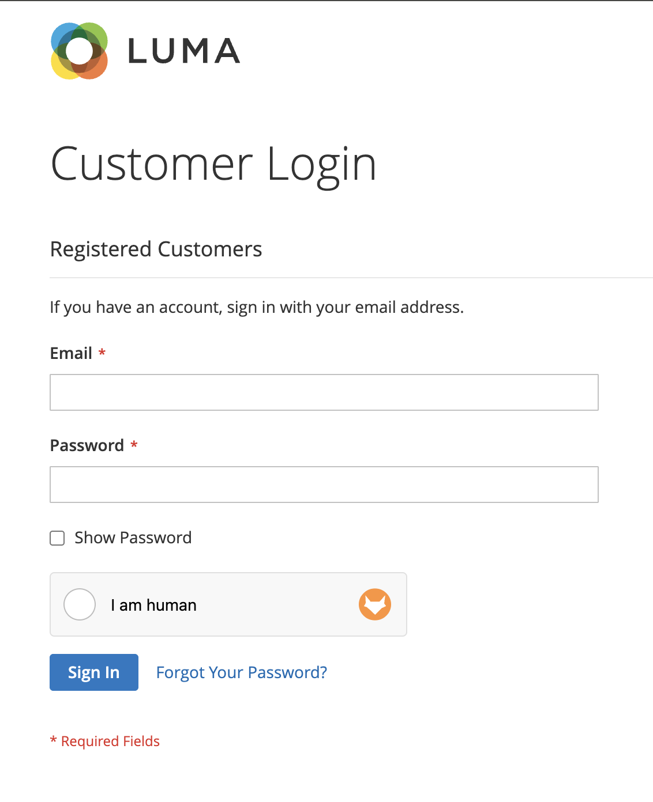

# CaptchaFox for Magento and Adobe Commerce

[](https://php.net/)
[](https://business.adobe.com/products/magento/magento-commerce.html)

[CaptchaFox](https://captchafox.com) offers GDPR-compliant CAPTCHA protection for you Magento OpenSource or Adobe Commerce forms.

 

## Supported Forms

### Frontend

- Contact
- Login
- Register
- Reset password
- Review
- Send product to friend
- Newsletter

### Admin

- Login
- Reset password

## Compatibility

| Package | Versions |
| ------- | -------- |
| Magento | >= 2.4.4 |
| PHP     | >= 8.0   |

## Installation

### Install via composer (recommended)

Run the following commands in the Magento 2 root folder:

```
composer require captchafox/magento
php bin/magento setup:upgrade
php bin/magento setup:static-content:deploy
```

### Manual install

Download and copy the files into `app/code/CaptchaFox/Core` and run the following commands:

```
php bin/magento setup:upgrade
php bin/magento setup:static-content:deploy
```

## Configuration

### Enable CaptchaFox

Navigate to *Stores > Configuration > Services > CaptchaFox*

#### Settings

- **Sitekey**: the sitekey given for the site in your CaptchaFox dashboard
- **Secret key**: the secret key given for the site in your CaptchaFox dashboard

#### Storefront

- **Enabled**: enable CaptchaFox
- **Theme**: the widget theme (light or dark)
- **Mode**: the widget mode (inline, popup)
- **Language**: the widget language (defaults to auto-detect)
- **Forms to validate**: the frontend forms where a CaptchaFox validation is required
- **Skip validation for logged in customers**: disabled by default. When enabled, customers with an
  active session are not shown the widget and their submissions are not validated server side.

#### Admin Panel

- **Enabled**: enable CaptchaFox
- **Theme**: the widget theme (light or dark)
- **Mode**: the widget mode (inline, popup)
- **Language**: the widget language (defaults to auto-detect)
- **Forms to validate**: the admin forms where a CaptchaFox validation is required

### Disable all Magento Captcha

*Stores > Configuration > Customers > Customer Configuration > CAPTCHA*

- **Enable CAPTCHA on Storefront**: no

*Stores > Configuration > Security > Google reCAPTCHA Storefront > Storefront*

- **Enable for Customer Login**: no
- **Enable for Forgot Password**: no
- **Enable for Create New Customer Account**: no
- **Enable for Contact Us**: no
- **Enable for Product Review**: no

*Stores > Configuration > Security > Google reCAPTCHA Admin Panel > Admin Panel*

- **Enable for Login**: no
- **Enable for Forgot Password**: no

### Override default **config**

You can specifically change theme and mode values for a form in the layout:

```xml
<?xml version="1.0"?>
<!-- layout/customer_account_login.xml -->
<page xmlns:xsi="http://www.w3.org/2001/XMLSchema-instance" xsi:noNamespaceSchemaLocation="urn:magento:framework:View/Layout/etc/page_configuration.xsd">
    <body>
        <referenceContainer name="form.additional.info">
            <block name="captchafox.login">
                <action method="setMode">
                    <argument name="mode" xsi:type="string">popup</argument>
                </action>
                <action method="setTheme">
                    <argument name="theme" xsi:type="string">dark</argument>
                </action>
            </block>
        </referenceContainer>
    </body>
</page>
```

### Removing re-captcha

To remove all native re-captcha modules, add all modules in the "replace" node of the `composer.json`.

```json
{
  "replace": {
    "magento/module-re-captcha-admin-ui": "*",
    "magento/module-re-captcha-checkout": "*",
    "magento/module-re-captcha-checkout-sales-rule": "*",
    "magento/module-re-captcha-contact": "*",
    "magento/module-re-captcha-customer": "*",
    "magento/module-re-captcha-frontend-ui": "*",
    "magento/module-re-captcha-gift-card": "*",
    "magento/module-re-captcha-invitation": "*",
    "magento/module-re-captcha-migration": "*",
    "magento/module-re-captcha-multiple-wishlist": "*",
    "magento/module-re-captcha-newsletter": "*",
    "magento/module-re-captcha-paypal": "*",
    "magento/module-re-captcha-review": "*",
    "magento/module-re-captcha-send-friend": "*",
    "magento/module-re-captcha-store-pickup": "*",
    "magento/module-re-captcha-ui": "*",
    "magento/module-re-captcha-user": "*",
    "magento/module-re-captcha-validation": "*",
    "magento/module-re-captcha-validation-api": "*",
    "magento/module-re-captcha-version-2-checkbox": "*",
    "magento/module-re-captcha-version-2-invisible": "*",
    "magento/module-re-captcha-version-3-invisible": "*",
    "magento/module-re-captcha-webapi-api": "*",
    "magento/module-re-captcha-webapi-graph-ql": "*",
    "magento/module-re-captcha-webapi-rest": "*",
    "magento/module-re-captcha-webapi-ui": "*"
  }
}
```

## Credits

Thanks to https://github.com/Pixel-Open for the base implementation.